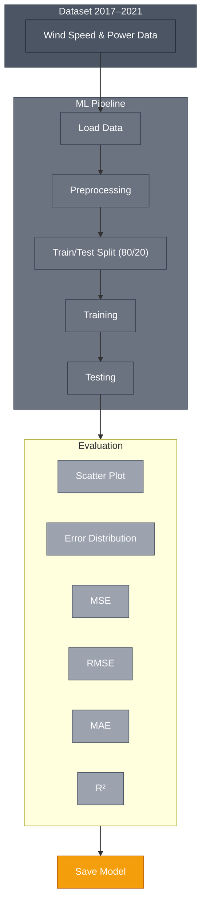

# Project03_46W38
Wind Power forecasting

## Dataset Description
The project relies on an hourly dataset of wind and power production recorded at 4 turbine sites, spanning the period 02.01.2017 → 31.12.2021, and released under an open “CC0 1.0 Universal” license.

### Variables
- Time — `YYYY-MM-DD HH:mm:ss`
- temperature_2m — °F @ 2 m
- relativehumidity_2m — %
- dewpoint_2m — °F
- windspeed_10m — m/s @ 10 m
- windspeed_100m — m/s @ 100 m
- winddirection_10m — deg (0–360) @ 10 m
- winddirection_100m — deg (0–360) @ 100 m
- windgusts_10m — m/s
- power — % of Prated (normalized)

---

## ML Steps

1. **loading**  
2. **preprocessing**  
3. **train/test split — 80% train, 20% test**  
4. **training**  
5. **testing**  
6. **evaluation**
   - **Plots**
     - Scatter plot: `y_true vs y_pred`
     - Error distribution
   - **Numerical metrics (regression)**
     - MSE — Mean Squared Error  
     - RMSE — Root Mean Square Error  
     - MAE — Mean Absolute Error  
     - R² — coefficient of determination  
7. **save_model**

---

## project03_46W38 Structure 

├── main.py                # entry point
├── load_data.py           # reading datasets
├── preprocessing.py       # cleaning and feature engineering
├── training.py            # training and evaluation
├── predicting.py          # loading model and predicting

---

## Pipeline Diagram (Mermaid)

